# TP1

## Step 1
Data generation is taken care of by the `generate_data.py` and data loading is taken care of by the `load.py` file  
Newly generated data is saved to the `client_data` folder  

## Step 2
This is taken care of by the `model.py` file  

## Step 3
This is taken care of by the `client.py` file  

## Step 4
This is taken care of by the `run_client.py` file. The command `python3 run_client.py --cid INTEGER` will run the client. The server must be running or else the client will fail  

## Step 5
The client manager is taken care of by the `custom_client_manager.py` file and the strategy is taken care of by the `fed_avg.py` file  

## Step 6
The server is contained in the `run_server.py` file. The following command runs the server `python3 run_server.py`  

## Step 7
This is taken care of by the `run_visualizer.py` file. The following command runs the data visualization: `python3 run_visualizer.py  --output NAME_OF_OUTPUT`  
Results are saved to the `plots` folder and end with what the user has enetered for NAME_OF_OUTPUT. The title of each plots also contains the NAME_OF_OUTPUT string

## Step 8
Hyperparameters are saved to the `config.py`  
In order to run the simulation, Multiple terminal tabs need to be opened. Complete the following steps to run the simulation
1. Run `python3 run_server.py`. The server will now be waiting for the specified number of clients to connect
2. Open as many terminal tabs as clients are required
3. Run `python3 run_client.py --cid INTEGER` making sure to change the CID Integer for each client
4. Wait for the tests to complete
5. Run `python3 run_visualizer.py --output NAME_OF_OUTPUT` to generate the images for reporting  

### Round 1
num of clients: 10  
alpha: 1  
rounds: 30  
epoch: 1  
[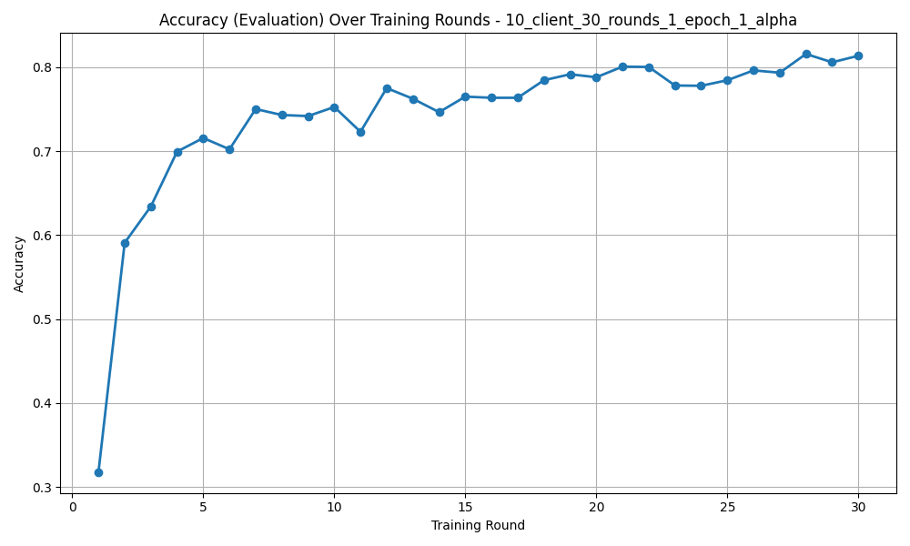](plots/accuracy_eval_plot_10_client_30_rounds_1_epoch_1_alpha.png)
[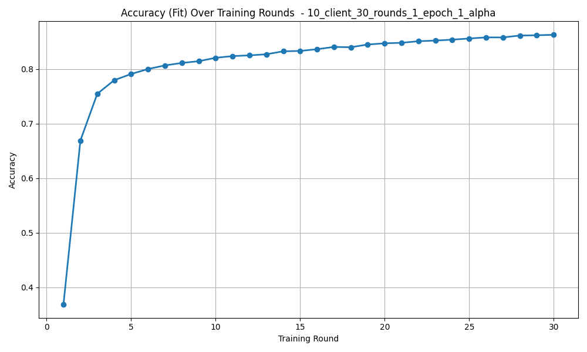](plots/accuracy_fit_plot_10_client_30_rounds_1_epoch_1_alpha.png)
[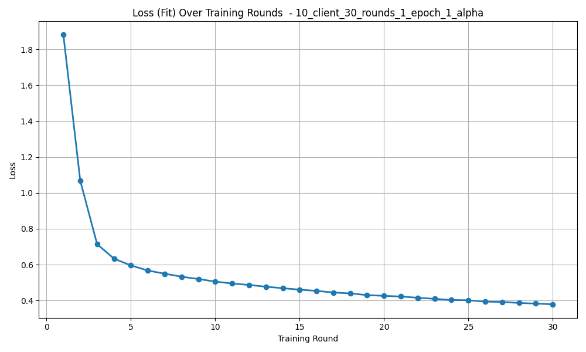](plots/loss_fit_plot_10_client_30_rounds_1_epoch_1_alpha.png)
[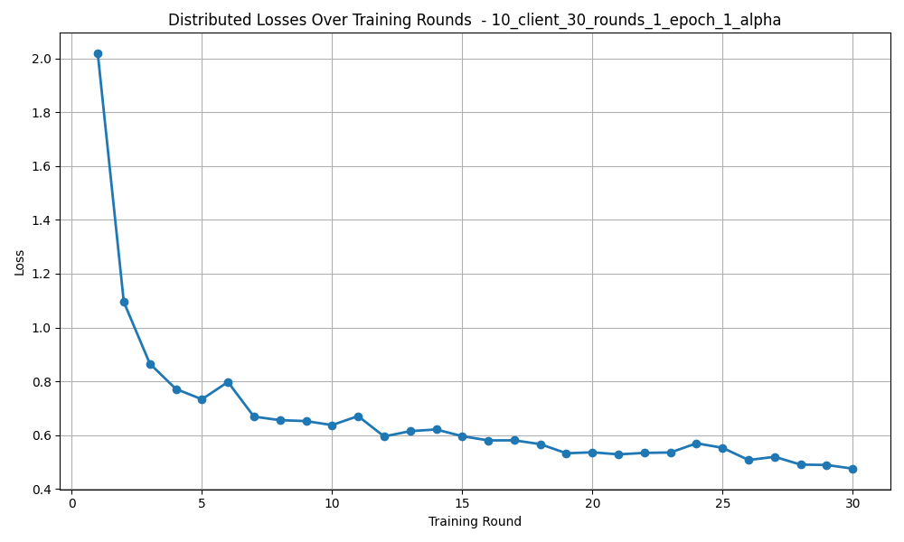](plots/losses_distributed_plot_10_client_30_rounds_1_epoch_1_alpha.png)

### Round 2
num of clients: 10  
alpha: 0.5  
rounds: 30  
epoch: 1  
[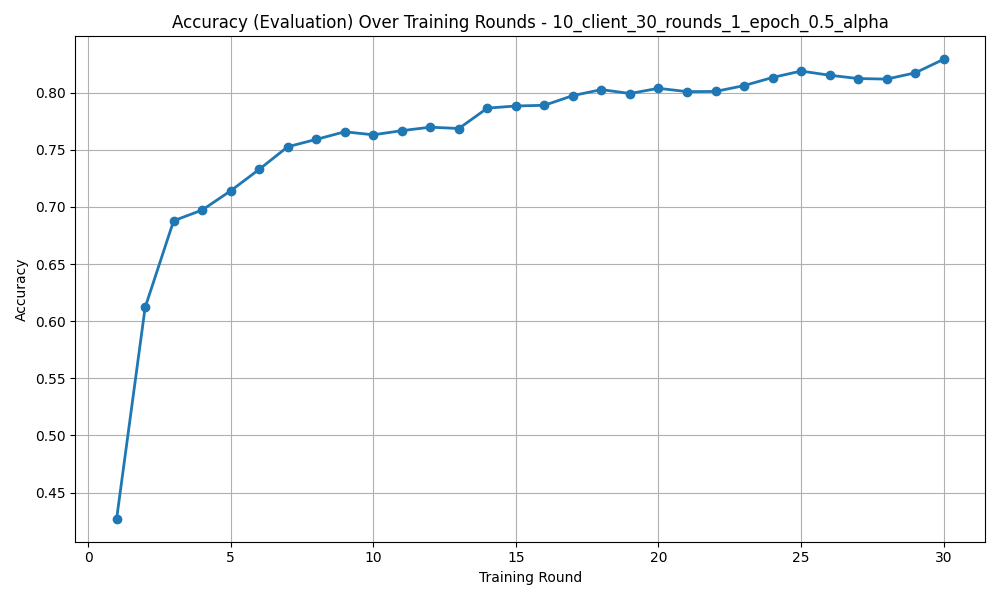](plots/accuracy_eval_plot_10_client_30_rounds_1_epoch_0.5_alpha.png)
[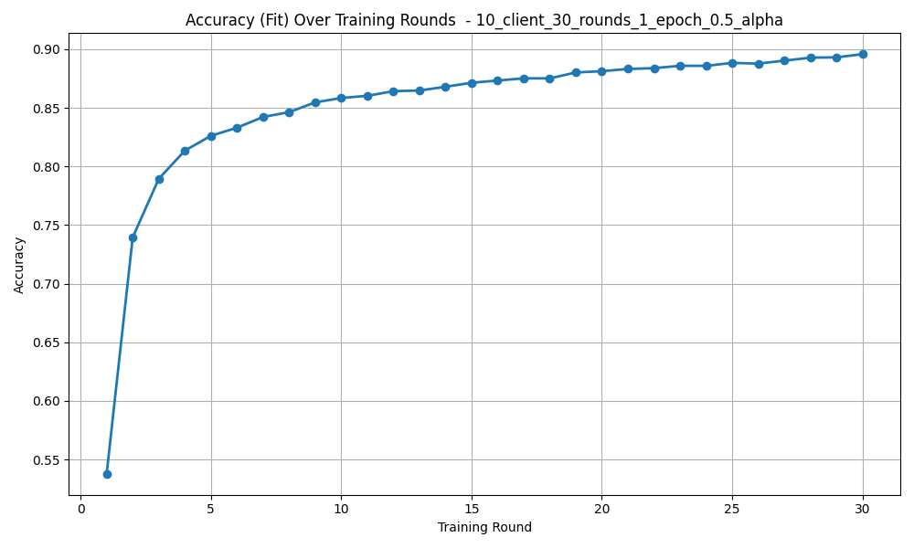](plots/accuracy_fit_plot_10_client_30_rounds_1_epoch_0.5_alpha.png)
[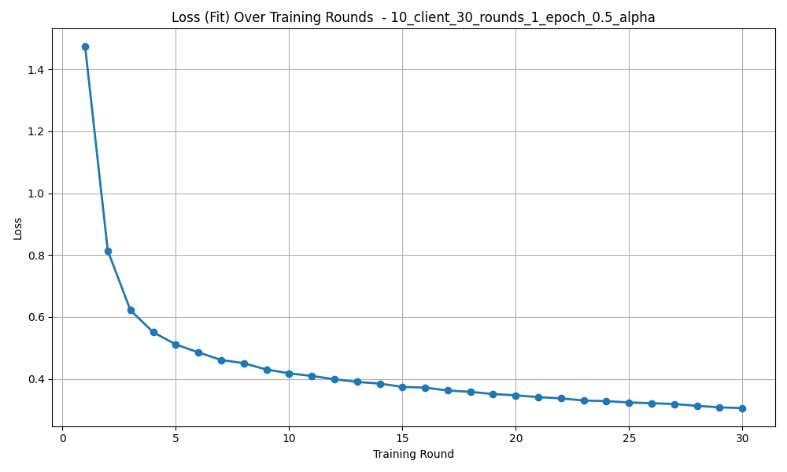](plots/loss_fit_plot_10_client_30_rounds_1_epoch_0.5_alpha.png)
[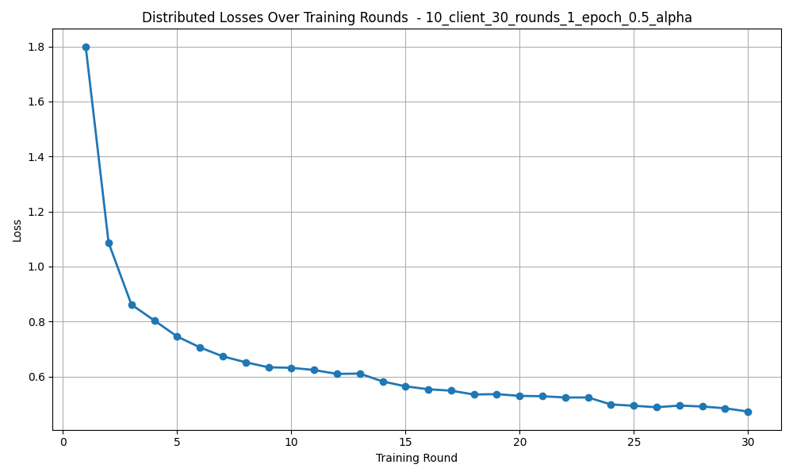](plots/losses_distributed_plot_10_client_30_rounds_1_epoch_0.5_alpha.png)

### Round 3
num of clients: 10  
alpha: 1  
rounds: 30  
epoch: 3  
[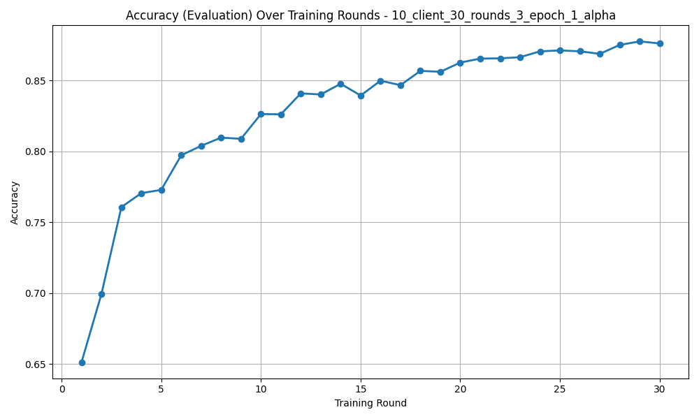](plots/accuracy_eval_plot_10_client_30_rounds_3_epoch_1_alpha.png)
[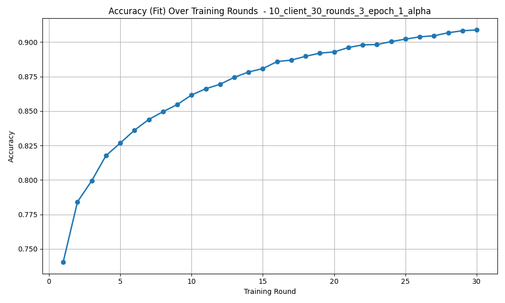](plots/accuracy_fit_plot_10_client_30_rounds_3_epoch_1_alpha.png)
[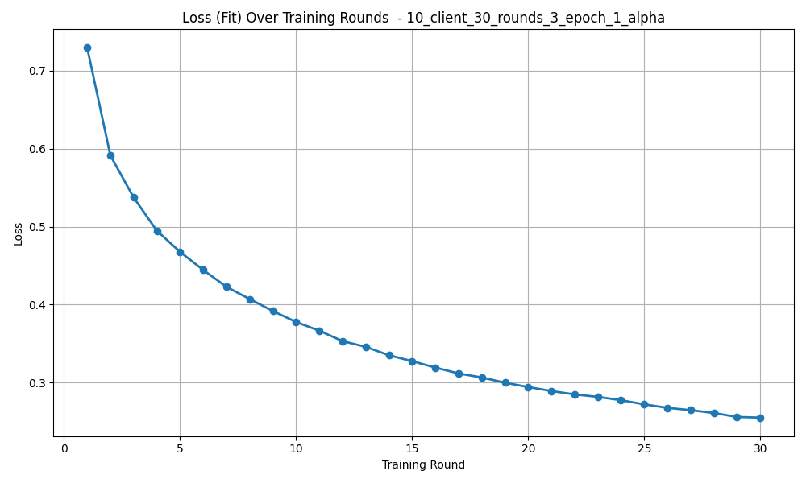](plots/loss_fit_plot_10_client_30_rounds_3_epoch_1_alpha.png)
[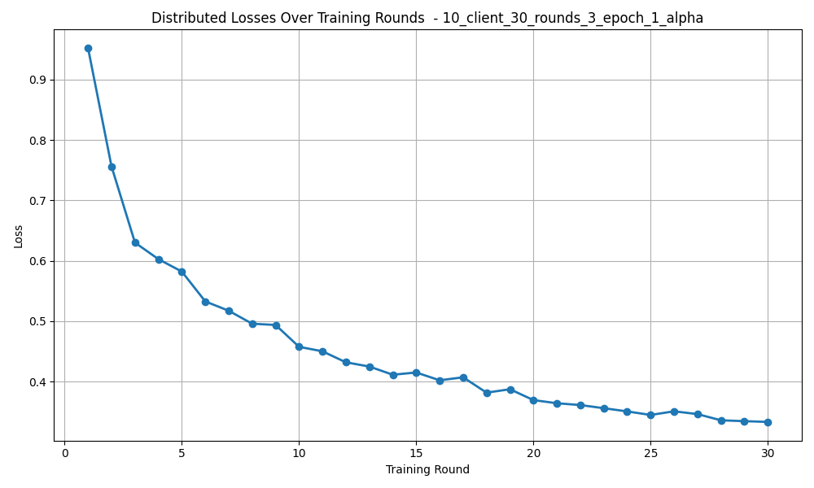](plots/losses_distributed_plot_10_client_30_rounds_3_epoch_1_alpha.png)

### Round 4
num of clients: 5  
alpha: 1  
rounds: 30  
epoch: 3  
[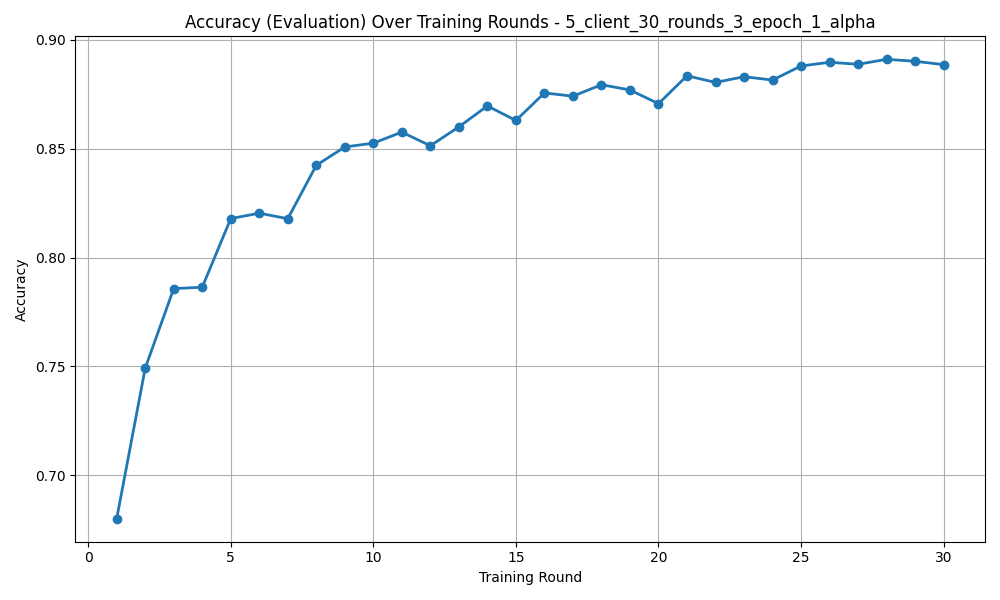](plots/accuracy_eval_plot_5_client_30_rounds_3_epoch_1_alpha.png)
[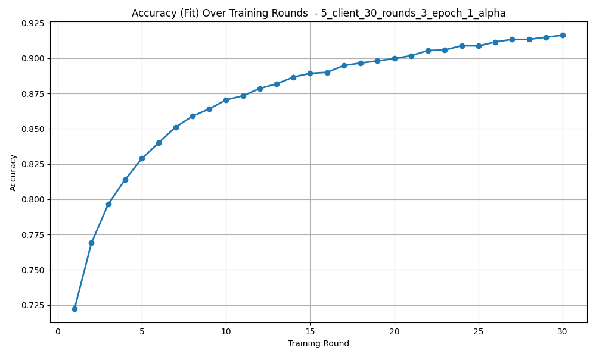](plots/accuracy_fit_plot_5_client_30_rounds_3_epoch_1_alpha.png)
[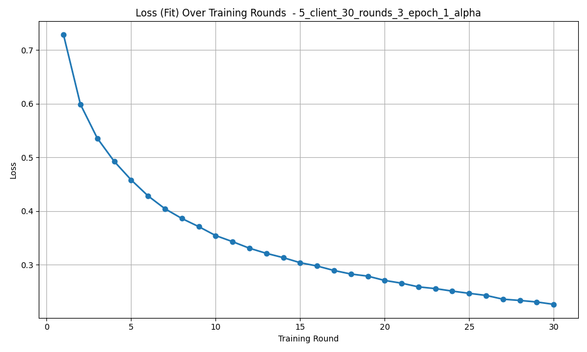](plots/loss_fit_plot_5_client_30_rounds_3_epoch_1_alpha.png)
[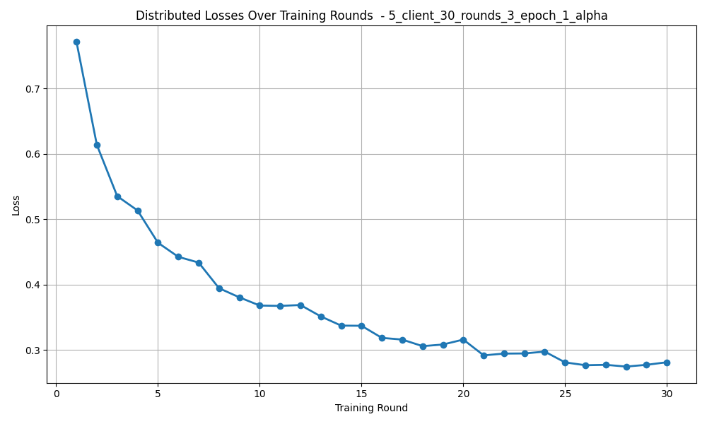](plots/losses_distributed_plot_5_client_30_rounds_3_epoch_1_alpha.png)